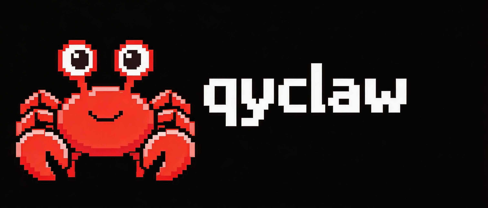

# Qyclaw

Qyclaw 是一个面向多租户场景的智能体任务平台。

它不是一个只会“聊天回复”的前端壳，也不是一个把整套智能体直接塞进容器里跑的黑盒。Qyclaw 的核心目标是：

- 让智能体真正可运行、可隔离、可审计
- 让用户记忆、技能、工具、外部连接都能分层管理
- 让同一个平台可以在不同智能体后端之间切换
- 让高风险执行进入容器沙箱，而不是把整套系统都绑死在容器里




## 项目定位

Qyclaw 可以理解为一个“平台化的智能体操作系统”：

- 上层是多用户、多会话、多技能、多连接器的平台能力
- 中间是队列、调度、记忆、权限、审计等运行时编排能力
- 下层是容器化工具执行沙箱

它适合这些场景：

- 团队内部的智能体工作台
- 带审批和审计的自动化任务执行
- 需要会话级工作区和文件处理的代理任务
- 需要用户记忆、技能管理、MCP 接入的 AI 平台
- 希望在 `deepagents` 和 `claude` 之间切换后端的系统

## 和 OpenClaw 相比，我们的优势

如果把 OpenClaw 理解为一个偏“单智能体执行内核”的基础形态，那么 Qyclaw 的重点不是简单复刻，而是把它平台化、可运营化、可隔离化。

Qyclaw 的增强点主要在这几个方向：

### 1. 多租户，而不是单会话实验项目

Qyclaw 原生支持：

- 用户体系
- 会话体系
- 技能发布与审核
- 会话级工作区
- 多用户隔离
- 管理端

这意味着它不是“本地 agent demo”，而是可以向团队内部真实交付的平台。

### 2. 记忆是分层的，不是只有上下文拼接

Qyclaw 现在把记忆拆成：

- 用户长期记忆
- 会话记忆
- 记忆候选
- 记忆审计日志

这带来的好处是：

- 用户偏好可以跨会话延续
- 当前会话状态不会污染所有会话
- 记忆的读取、提取、更新都能审计
- 后续可以继续扩展到 tenant 级记忆策略

### 3. 工具、技能、连接器是分层建模的

Qyclaw 不是把所有能力都混成“tool”。

当前系统已经区分：

- `System Tool`
  - 平台内建能力
  - 比如 terminal、web_search、fetch_url
- `Skill`
  - 面向行为和流程封装
  - 支持草稿、发布、分组、共享、复制
- `MCP Connection`
  - 面向用户自己的外部能力接入
  - 比如 GitHub、Postgres、Notion、Custom HTTP

这种拆分非常重要，因为它让权限边界更清楚：

- 平台能力归平台
- 用户连接归用户
- 行为封装归技能系统

### 4. 容器化隔离的是“工具执行”，不是整套智能体运行

这是 Qyclaw 一个非常关键的设计边界。

Qyclaw 并不是把整个 agent runtime 扔进容器里跑，而是采用：

- 智能体编排在主系统
- 工具执行在容器沙箱

也就是说：

- 队列
- 会话状态
- 记忆编译
- 审批流
- SSE 推流
- 多智能体后端切换

这些都在主系统中完成。

而下面这些高风险动作，才进入容器：

- shell 命令执行
- 文件读写
- 技能脚本运行
- Office/PDF/文件处理
- 工作区内工具调用

这样做的优势是：

- 主系统更容易管理状态和恢复
- 安全边界更清晰
- 工具风险被限定在沙箱中
- 不会因为容器生命周期把整套 agent state 搅乱

### 5. 不止一个智能体后端

Qyclaw 当前支持按会话切换执行后端：

- `deepagents`
- `claude`

这意味着平台层和智能体后端是解耦的：

- 会话、记忆、技能、MCP、审计这些资产保留在平台里
- 后端可以逐步切换、灰度、fallback

这比“整个系统和单一 agent runtime 深绑定”更灵活。

### 6. 队列和调度能力更适合真实业务

Qyclaw 不是简单的“一条消息直接跑一轮”。

系统已经引入：

- 会话级串行队列
- 全局并发控制
- 调度任务
- 重试与退避
- backend 路由与 fallback

这让它更适合：

- 多用户并发
- 定时任务
- 文件任务
- 长任务执行
- 人工审批恢复

## 核心能力

### 1. 多会话、多用户、多租户基础

- 用户登录与权限体系
- 会话管理
- 会话消息流
- 管理端
- 会话级 backend 选择

### 2. 智能体记忆

- 用户长期记忆
- 会话记忆
- 记忆候选提取
- 记忆审计日志
- 记忆与会话实例绑定

Qyclaw 的设计原则是：

> 用户长期记忆属于用户，由会话实例加载和更新；  
> 会话记忆属于当前实例，不自动污染长期记忆。

### Hindsight 长期记忆集成

Qyclaw 现已支持把用户长期记忆接入 [Hindsight](https://github.com/latent-knowledge/hindsight)。

Hindsight 项目地址：

- GitHub: `https://github.com/latent-knowledge/hindsight`

当前接入方式如下：

- 长期记忆按 `user:{user_id}` 聚合，不再按会话拆 bank
- 回答前调用 Hindsight `recall`，把与当前问题相关的用户长期记忆注入提示词
- 回答后调用 Hindsight `retain`，把用户输入和助手回答写入长期记忆
- 会话 `conversation_id` 仍保留在 metadata/tag 中，用于来源追踪，但不参与长期记忆隔离
- 本地数据库仍保留聊天消息和会话摘要；长期语义记忆由 Hindsight 提供

当前默认不会在每轮主链路中同步执行 `reflect`。Qyclaw 采用低频异步反思策略：

- 每个用户累计完成若干轮 `retain_turn` 后，异步触发一次 Hindsight `reflect`
- 触发阈值由配置项 `hindsight.reflect_every_turns` 控制
- 设置为 `0` 时表示关闭自动 reflect

相关配置位于 `config.yaml`：

```yaml
hindsight:
  enabled: true
  base_url: "http://127.0.0.1:8888"
  api_key:
  timeout: 30.0
  user_bank_prefix: "user"
  recall_budget: "mid"
  recall_max_tokens: 1000
  retain_async: false
  reflect_every_turns: 20
```

配置说明：

- `enabled`: 是否启用 Hindsight
- `base_url`: Hindsight 服务地址
- `api_key`: 可选认证令牌
- `timeout`: 单次 Hindsight 请求超时秒数
- `user_bank_prefix`: 用户 bank 前缀，最终 bank 形如 `user:{user_id}`
- `recall_budget`: 召回预算，建议 `low`、`mid`、`high`
- `recall_max_tokens`: 召回内容最大 token 限制
- `retain_async`: 是否异步 retain；验证记忆写入时建议先设为 `false`
- `reflect_every_turns`: 每多少个用户回合异步触发一次 reflect；`0` 表示关闭

如果你希望“前几轮说过的名字”在新会话里也能召回，建议：

- 确保后端已重启并加载了最新配置
- 先将 `retain_async` 设为 `false`，避免写入尚未完成就开始新会话测试
- 将 `recall_budget` 调整为 `low` 或 `mid`
- 在新会话中用明确问题测试，例如“你记得我叫什么名字吗？”

### 3. 工具系统

Qyclaw 目前对工具做了系统级建模：

- 工具启用/禁用
- 风险等级
- 是否需要审批
- 是否必须在容器中执行
- backend 支持范围

高风险工具会受到更严格的限制，例如：

- terminal 命令校验
- debug_exec 权限控制
- 文件路径真实路径校验
- 容器挂载范围收紧

### 4. 技能系统

Qyclaw 的技能系统不是简单的“prompt 模板”。

它支持：

- 技能草稿
- 技能发布
- 技能审核
- 技能复制
- 技能分组
- 技能作用域

当前技能作用域包括：

- `global`
- `group`
- `user`
- `conversation`

### 5. MCP 连接体系

Qyclaw 把用户自己的外部能力建模为 MCP，而不是硬塞进全局 tool。

当前已经支持：

- MCP server definition
- MCP connection
- MCP binding
- 会话级绑定
- 用户私有连接隔离

这使得“用户自己的 GitHub / Postgres / Notion / 自定义 HTTP 连接”可以被平台正式管理。

### 6. 定时任务和调度

Qyclaw 已具备：

- 定时任务模型
- 任务运行日志
- scheduler
- 任务统一进入 runtime queue

这意味着它不仅能做对话式 agent，也能做自动化 agent。

## 架构说明

Qyclaw 当前架构可以分成 4 层。

### 1. 平台层

负责：

- 用户
- 会话
- 技能
- MCP
- 管理端
- 前端
- API

技术栈：

- FastAPI
- SQLAlchemy
- Vue + Vuetify

### 2. 编排层

负责：

- work item
- 队列
- 调度
- backend 路由
- 会话级串行执行
- fallback

这一层是 Qyclaw 相比传统“消息来就直接调模型”的最大增强点之一。

### 3. 智能体后端层

负责：

- `deepagents` backend
- `claude` backend

它们共享平台资产，但执行后端可以不同。

### 4. 执行沙箱层

负责：

- 动态容器
- 工作区挂载
- 技能目录挂载
- 工具调用沙箱
- 文件处理

再次强调：

> 容器只做工具执行沙箱，不承载整套智能体运行。

## 安全与隔离设计

Qyclaw 重点强化了这几类隔离：

### 用户隔离

- 用户长期记忆按 `user_id` 隔离
- 用户私有 skill 按 `user` scope 隔离
- 用户私有 MCP connection 按 `owner_user_id` 隔离

### 会话隔离

- 会话工作区按 `conversation_id` 隔离
- 会话记忆按 `conversation_id` 隔离
- 会话绑定的 MCP 和 skill 可单独控制

### 工具隔离

- 高风险工具受权限控制
- 文件路径受真实路径校验
- 容器挂载最小化
- terminal/debug_exec 收紧

## 为什么“容器只做工具沙箱”很重要

很多系统会把整个 agent runtime 放进容器里，表面上看简单，但会带来一些问题：

- 会话状态难以管理
- 记忆和数据库更新难以统一
- 审批恢复逻辑容易碎裂
- 多后端切换困难
- 平台资产和执行容器耦合过深

Qyclaw 选择的是另一条路线：

- 主系统负责“思考、调度、记忆、状态、权限”
- 容器负责“执行、读写、调用工具、访问工作区”

这让系统更像一个平台，而不是一个容器内 agent demo。

## 适合什么团队

Qyclaw 特别适合：

- 想做团队版 agent 平台的团队
- 想引入技能、记忆、审批、调度的场景
- 想把工具风险限制在容器中的团队
- 想支持多智能体后端切换的产品
- 想把 MCP 作为用户级连接器能力来管理的系统

## 当前项目特征总结

一句话概括：

> Qyclaw 是一个“平台编排在主系统、工具执行在容器、记忆分层、能力分层、后端可切换”的多租户智能体平台。

它的核心价值不只是“能跑 agent”，而是：

- 让 agent 真正进入平台化管理
- 让隔离、审计、记忆、技能、连接器都有正式模型
- 让系统可以持续演进，而不是停留在 demo 级架构

## 快速开始

### 方式一：Docker 启动

适合直接部署整套服务。`qyclaw` 应用会通过 [`Dockerfile`](/e:/rail_user_data/qyclaw/teamclaw/Dockerfile) 自动构建，数据库和沙箱容器由 compose 一起拉起。

启动前建议先检查这几组关键配置：

- `backend_routing.default_backend`: 默认后端，常见值是 `deepagents` 或 `claude`
- `claude_agent.enabled / model / base_url / api_key / cli_path`: Claude Agent SDK 后端实际使用的模型和接入地址
- `models.providers`: 非 Claude Agent 路径下的默认模型提供商列表，当前运行时优先取排在最前面的 provider 和它的第一个 model

`claude_agent.model` 必须填写你的上游兼容端点实际支持的 model id，不要写想当然的别名。`claude_agent` 当前会优先使用这一段配置，而不是会话里残留的模型名。

```bash
git clone https://github.com/cookeem/qyclaw.git
cd qyclaw

# 1. 编辑 Docker 部署配置
#    按需修改 backend_routing / claude_agent / models.providers / api_keys.tavily / smtp 等配置
$EDITOR config-docker.yaml

# 2. 生成 Docker daemon TLS 证书，输出到 ./certs
sh docker_certs.sh

# 3. 构建并启动全部服务
docker compose -f docker-compose-docker.yaml up -d --build
```

访问：

- Frontend: `http://localhost:8080/frontend/`
- Backend: `http://localhost:8000/docs`

停止：

```bash
docker compose -f docker-compose-docker.yaml down
```

### 方式二：命令行启动

适合开发和调试。数据库、Docker 沙箱仍通过 compose 启动；后端和前端在本机命令行里分别运行。

本地启动时，重点检查根目录 [`config.yaml`](/e:/rail_user_data/qyclaw/teamclaw/config.yaml) 里的这些项：

- `backend_routing.default_backend`
- `claude_agent.enabled`
- `claude_agent.model`
- `claude_agent.base_url`
- `claude_agent.api_key`
- `claude_agent.cli_path`
- `models.providers`

推荐理解方式：

- 如果你要走 `claude` 后端，优先确认 `claude_agent.*`
- 如果你要走 `deepagents`，优先确认 `models.providers.*`

```bash
git clone https://github.com/cookeem/qyclaw.git
cd qyclaw

# 1. 编辑本地运行配置
#    按需修改 backend_routing / claude_agent / models.providers / api_keys.tavily / smtp 等配置
$EDITOR config.yaml

# 2. 生成 Docker daemon TLS 证书，输出到 ./certs
sh docker_certs.sh

# 3. 启动基础设施
docker compose up -d postgres docker-0.docker docker-1.docker

# 4. 安装依赖
python -m pip install -r requirements.txt
python -m pip install -r requirements-models.txt

# 5. 启动后端
python -m backend.main
```

另开一个终端启动前端开发服务：

```bash
cd qyclaw
cd frontend-vue
npm install
npm run dev
```

访问：

- Frontend: `http://127.0.0.1:5173`
- Backend: `http://localhost:8000/docs`

如果需要构建前端生产包：

```bash
cd qyclaw
cd frontend-vue
npm install
npm run build
```

构建产物输出到 `frontend-vue/dist`。如需本地预览构建结果，可执行：

```bash
cd qyclaw
cd frontend-vue
npm run preview
```

停止基础设施：

```bash
docker compose down
```

## 后续方向

Qyclaw 后续很适合继续往这些方向演进：

- 更完整的 MCP runtime 集成
- 更细粒度的 tool 权限模型
- 更强的 memory 管理与回收策略
- 更完善的审计与运营后台
- 更成熟的多后端 agent 路由能力
